<!--
  ═══════════════════════════════════════════════════════════════════════
  PLAYER PROFILE — GitHub README for Aditya Mittal
  Fully custom SVG cards, warm coffee palette, seamless edge-to-edge.

  SETUP (2 steps, replaces the old "just paste text" version):
    1. In your adityamittal0786/adityamittal0786 repo, create a folder
       named exactly "assets" and upload all 8 .svg files you were given
       into it (hero.svg, player-card.svg, arsenal.svg, achievements.svg,
       music.svg, loading-tip.svg, connect.svg, footer.svg).
    2. Paste this file's contents as your README.md. The  tags below
       point to "assets/xxx.svg" — relative paths, so they resolve
       automatically once the files sit in that folder in the same repo.

  Why SVG files instead of the widget banners from before: every image
  below is self-contained — no third-party API calls, nothing that can
  go down and leave you with a broken image (that's what fixed the
  Achievement Vault). The color, the gradient, the glow, the little
  floating lights — all of it is baked directly into each file, so it's
  actually fully colored edge-to-edge, not just a strip at the top.

  Username, email, and LinkedIn are wired in below. No Spotify account
  needed anywhere — the music section is just vibe, not a live feed.
  ═══════════════════════════════════════════════════════════════════════
-->

☕ &nbsp;<b>tap to see what's brewing</b>

 

Right now it's mostly small builds, a lot of reading other people's code,
and figuring out which parts of a project are actually worth doing by
hand versus handing to an AI copilot. No polished case studies yet —
just steady reps.

 

